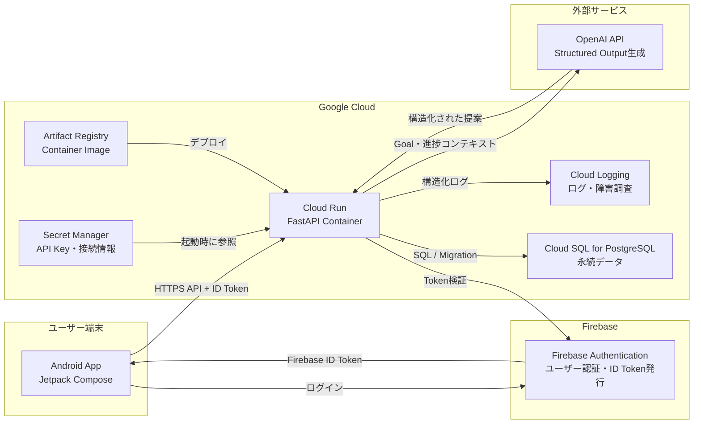
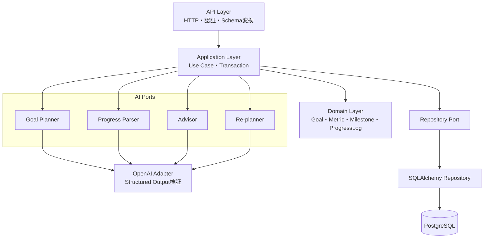
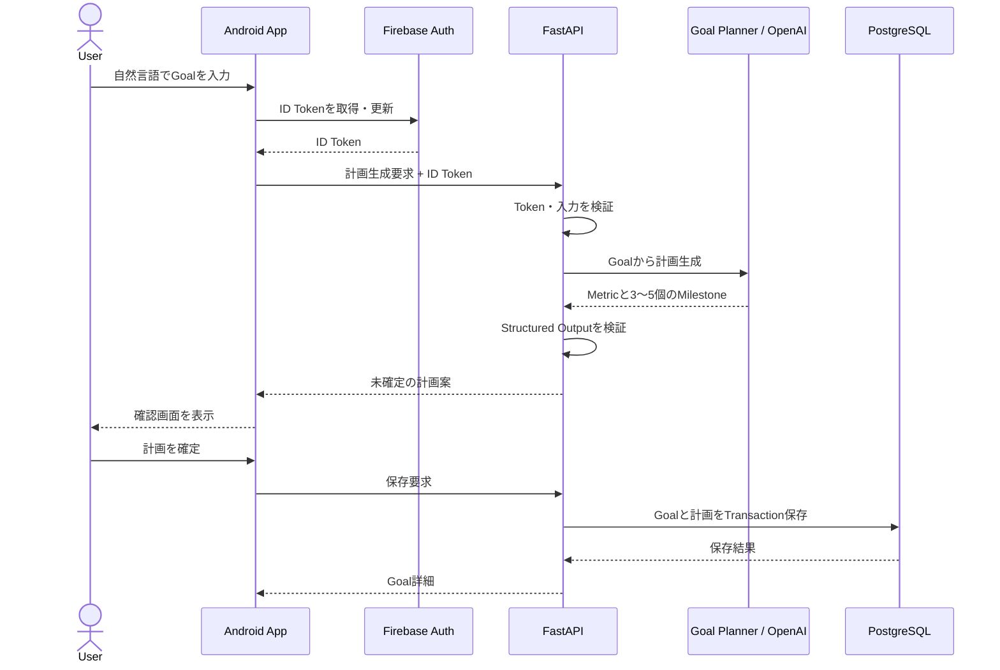

# システムアーキテクチャ

## 全体構成

AndroidはFirebase AuthenticationとFastAPIだけに接続します。DBとOpenAI APIへ直接接続せず、認可、検証、永続化はBackendに集約します。

## サービスの責務

| サービス | 主な責務 | 担わないこと |
| --- | --- | --- |
| Android App | 入力、計画確認、進捗表示、ID Token付きAPI通信 | AI API呼び出し、DB直接操作、秘密情報保持 |
| Firebase Authentication | ログイン、ユーザー識別、ID Token発行 | Goalデータ管理、業務上の認可判断 |
| FastAPI / Cloud Run | API、Token検証、認可、ドメイン処理、AI連携、DB操作 | UI描画、AI出力の無検証保存 |
| Cloud SQL | Goal、Metric、Milestone、ProgressLogの永続化 | AI処理、クライアントからの直接アクセス |
| OpenAI API | 計画、進捗解析、助言、再計画案の生成 | 正本データの保持、変更の自動確定 |
| Secret Manager | APIキーと接続情報の安全な保管 | アプリケーションデータの保管 |
| Artifact Registry | Backendコンテナイメージの保管 | アプリ実行、DB永続化 |
| Cloud Logging | Backendログの収集と障害調査 | Goalや進捗の正本保管 |

## Backend内部構成

- API LayerはHTTP固有処理を担当します。
- Application Layerはユースケース、認可、トランザクションを制御します。
- Domain Layerは固定Schemaと業務ルールを保持します。
- AI Agentは責務ごとに独立したPortと評価を持ちます。
- Adapterを差し替え、通常テストではOpenAIの代わりにFakeを使用します。

## 主要な連携フロー

### Goal計画の作成と確定

AIが生成した計画は直ちに保存せず、検証後にAndroidへ返します。ユーザーの確定操作を受けて初めて正本データとして保存します。

### 進捗記録と助言

1. Androidが自然言語の進捗報告をFastAPIへ送る。
2. Progress Parserが報告をMetric更新候補へ変換する。
3. Backendが構造と業務ルールを検証してProgressLogを保存する。
4. Advisorが保存済みデータをもとに次の行動を提案する。
5. 再計画が必要な場合も、ユーザー確認前には既存計画を変更しない。

## セキュリティ境界

- すべての業務APIはHTTPSとFirebase ID Tokenを要求する。
- BackendはTokenの`uid`を所有者IDとして使い、他ユーザーのデータ参照を拒否する。
- OpenAIへ送信する情報は必要最小限とし、認証情報を含めない。
- AI出力は信頼せず、Pydantic Schemaとドメインルールで検証する。
- DBとSecret ManagerはCloud Runのサービスアカウントだけに必要最小限の権限を付与する。
- ログにToken、APIキー、個人の入力全文を不用意に記録しない。

## 開発フェーズとの差分

通常のローカル開発ではCloud SQLをローカルPostgreSQLに、OpenAI AdapterをFakeに置き換えます。クラウド結合環境では同じPortをCloud SQLとOpenAI Adapterへ接続します。詳細は`development-infrastructure.md`を参照してください。
