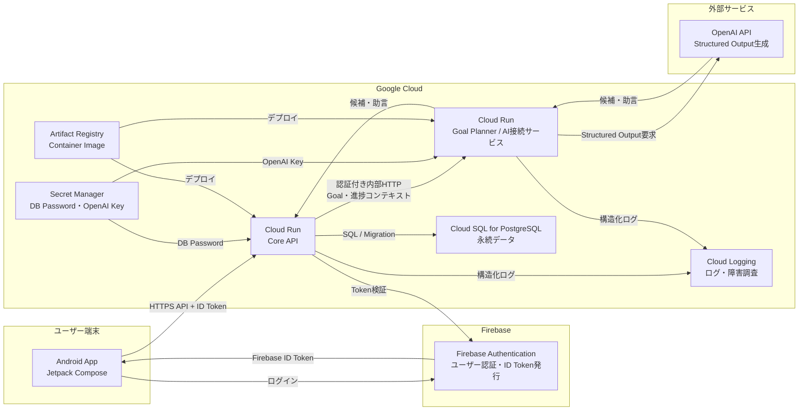
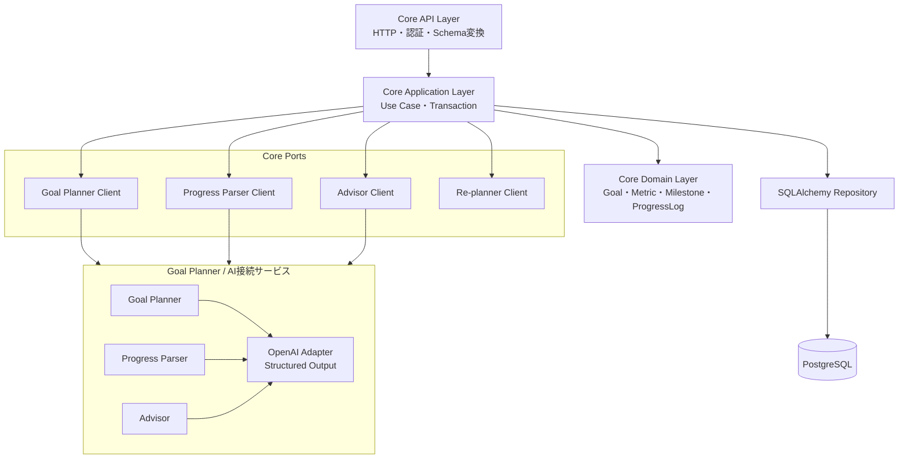
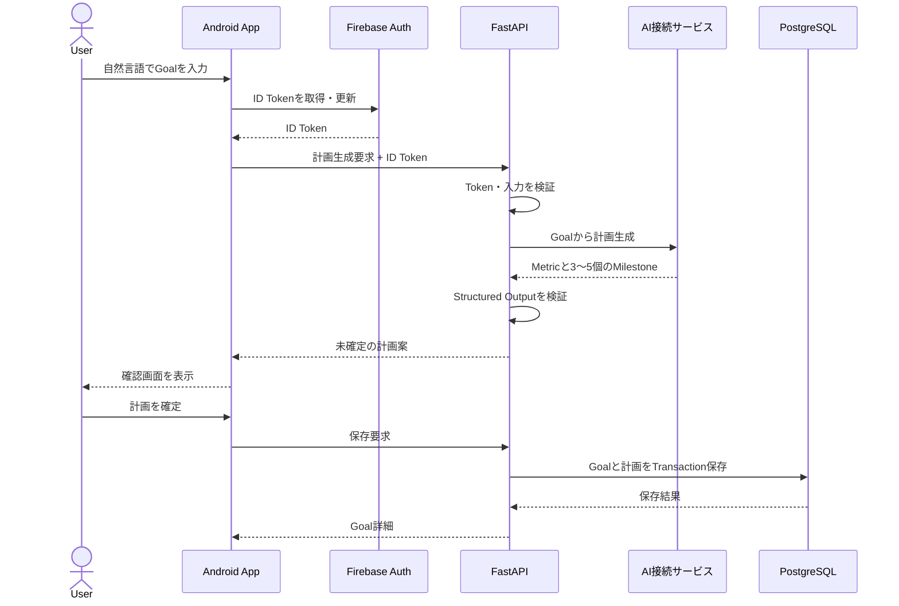

# システムアーキテクチャ

## 全体構成

```mermaid
flowchart LR
    subgraph Client["ユーザー端末"]
        Android["Android App<br/>Jetpack Compose"]
    end

    subgraph Firebase["Firebase"]
        Auth["Firebase Authentication<br/>ユーザー認証・ID Token発行"]
    end

    subgraph GCP["Google Cloud"]
        Core["Cloud Run<br/>Core API"]
        AIService["Cloud Run<br/>Goal Planner / AI接続サービス"]
        Secrets["Secret Manager<br/>DB Password・OpenAI Key"]
        Registry["Artifact Registry<br/>Container Image"]
        Logging["Cloud Logging<br/>ログ・障害調査"]
        SQL["Cloud SQL for PostgreSQL<br/>永続データ"]
    end

    subgraph External["外部サービス"]
        OpenAI["OpenAI API<br/>Structured Output生成"]
    end

    Android -->|"ログイン"| Auth
    Auth -->|"Firebase ID Token"| Android
    Android -->|"HTTPS API + ID Token"| Core
    Core -->|"Token検証"| Auth
    Core -->|"SQL / Migration"| SQL
    Core -->|"認証付き内部HTTP<br/>Goal・進捗コンテキスト"| AIService
    AIService -->|"Structured Output要求"| OpenAI
    OpenAI -->|"候補・助言"| AIService
    AIService -->|"候補・助言"| Core
    Secrets -->|"DB Password"| Core
    Secrets -->|"OpenAI Key"| AIService
    Registry -->|"デプロイ"| Core
    Registry -->|"デプロイ"| AIService
    Core -->|"構造化ログ"| Logging
    AIService -->|"構造化ログ"| Logging
```

AndroidはFirebase AuthenticationとCore APIだけに接続します。DB、OpenAI API、内部AI接続サービスへ直接接続しません。Core APIは正本DB、認可、ユーザー確認、最終検証を担当し、OpenAI SDK・API Key・プロンプトを持ちません。Goal Planner Serviceは当面のAI接続サービスとして、初期計画、進捗解析候補、助言を生成するステートレスな内部サービスです。

## サービスの責務

| サービス | 主な責務 | 担わないこと |
| --- | --- | --- |
| Android App | 入力、計画確認、進捗候補の確認・修正、進捗表示、ID Token付きAPI通信 | AI API呼び出し、DB直接操作、秘密情報保持 |
| Firebase Authentication | ログイン、ユーザー識別、ID Token発行 | Goalデータ管理、業務上の認可判断 |
| Core API | Android公開API、Token検証、所有者認可、Goal/Metric/Milestone/ProgressLogの正本管理、AI出力の業務検証、ユーザー確認後の保存 | OpenAI SDK/API Key、プロンプト管理、正本化前のAI候補生成 |
| Goal Planner / AI接続サービス | OpenAI SDK/API Key、プロンプト、Structured Output schema、timeout/retry/refusal処理、Fake/実AI回帰評価、初期計画・進捗候補・助言生成 | Android公開API、ユーザー認可、アプリDBアクセス、AI出力の自動保存 |
| Cloud SQL | Goal、Metric、Milestone、ProgressLogの永続化 | AI処理、クライアントからの直接アクセス |
| OpenAI API | 計画、進捗解析、助言、再計画案の生成 | 正本データの保持、変更の自動確定 |
| Secret Manager | DB passwordとOpenAI API keyの安全な保管 | アプリケーションデータの保管 |
| Artifact Registry | Backendコンテナイメージの保管 | アプリ実行、DB永続化 |
| Cloud Logging | Backendログの収集と障害調査 | Goalや進捗の正本保管 |

## Backend内部構成

```mermaid
flowchart TB
    API["Core API Layer<br/>HTTP・認証・Schema変換"]
    App["Core Application Layer<br/>Use Case・Transaction"]
    Domain["Core Domain Layer<br/>Goal・Metric・Milestone・ProgressLog"]

    subgraph CorePorts["Core Ports"]
        PlannerPort["Goal Planner Client"]
        ParserPort["Progress Parser Client"]
        AdvisorPort["Advisor Client"]
        ReplannerPort["Re-planner Client"]
    end

    subgraph AISvc["Goal Planner / AI接続サービス"]
        Planner["Goal Planner"]
        Parser["Progress Parser"]
        Advisor["Advisor"]
        AIAdapter["OpenAI Adapter<br/>Structured Output"]
    end

    DBAdapter["SQLAlchemy Repository"]
    PostgreSQL[("PostgreSQL")]

    API --> App
    App --> Domain
    App --> PlannerPort
    App --> ParserPort
    App --> AdvisorPort
    App --> ReplannerPort
    App --> DBAdapter
    PlannerPort --> AISvc
    ParserPort --> AISvc
    AdvisorPort --> AISvc
    Planner --> AIAdapter
    Parser --> AIAdapter
    Advisor --> AIAdapter
    DBAdapter --> PostgreSQL
```

- Core APIはHTTP固有処理、認可、トランザクション、正本DB更新を担当します。
- AI接続サービスは責務ごとに独立したProviderと評価を持ち、アプリDBを持ちません。
- AI出力はCore APIが再検証し、ユーザー確認を経るまで候補です。
- 通常テストではOpenAIの代わりにFakeを使用します。

## 主要な連携フロー

### Goal計画の作成と確定

```mermaid
sequenceDiagram
    actor User as User
    participant App as Android App
    participant Auth as Firebase Auth
    participant API as FastAPI
    participant AI as AI接続サービス
    participant DB as PostgreSQL

    User->>App: 自然言語でGoalを入力
    App->>Auth: ID Tokenを取得・更新
    Auth-->>App: ID Token
    App->>API: 計画生成要求 + ID Token
    API->>API: Token・入力を検証
    API->>AI: Goalから計画生成
    AI-->>API: Metricと3〜5個のMilestone
    API->>API: Structured Outputを検証
    API-->>App: 未確定の計画案
    App-->>User: 確認画面を表示
    User->>App: 計画を確定
    App->>API: 保存要求
    API->>DB: Goalと計画をTransaction保存
    DB-->>API: 保存結果
    API-->>App: Goal詳細
```

AIが生成した計画は直ちに保存せず、検証後にAndroidへ返します。ユーザーの確定操作を受けて初めて正本データとして保存します。

### 進捗記録と助言

1. Androidが自然言語の進捗報告をFastAPIへ送る。
2. Progress Parserが報告をMetric更新候補へ変換する。
3. Backendが構造と業務ルールを検証してProgressLogを保存する。
4. Advisorが保存済みデータをもとに次の行動を提案する。
5. 再計画が必要な場合も、ユーザー確認前には既存計画を変更しない。

## セキュリティ境界

- すべての業務APIはHTTPSとFirebase ID Tokenを要求する。
- BackendはTokenの`uid`を所有者IDとして使い、他ユーザーのデータ参照を拒否する。
- OpenAIへ送信する情報は必要最小限とし、認証情報を含めない。
- AI出力は信頼せず、Pydantic Schemaとドメインルールで検証する。
- DBとSecret ManagerはCloud Runのサービスアカウントだけに必要最小限の権限を付与する。
- ログにToken、APIキー、個人の入力全文を不用意に記録しない。

## 開発フェーズとの差分

通常のローカル開発ではCloud SQLをローカルPostgreSQLに、OpenAI AdapterをFakeに置き換えます。クラウド結合環境では同じPortをCloud SQLとOpenAI Adapterへ接続します。詳細は`development-infrastructure.md`を参照してください。

## Weekend 7の実装境界

Progress ParserとAdvisorはCore API内では独立Portだが、実AI生成はGoal Planner / AI接続サービスへHTTPで委譲する。Androidから解析要求を受けたらCore APIが所有者確認済みGoalのMetricだけを内部サービスへ送り、候補を受け取る。解析処理は正本を変更しない。ユーザーの確認後、従来の進捗APIがGoal行のロック内で加算と履歴を保存する。

保存後にAndroidが別APIで助言を要求する。AdvisorにはCore APIから保存済みGoal、Metric、Milestoneと最新10件の履歴を渡し、計画変更・DB書込みを許可しない。助言失敗時も進捗は維持され、助言だけ再試行できる。AI呼び出し前に読取りtransactionを終了する。候補と助言の追加永続化・migrationは導入しない。

実AIモードでもCore APIはOpenAIへ直接接続しない。OpenAI SecretのAccessorはGoal Planner / AI接続サービスのruntime service accountだけに付与する。Core API runtime service accountはDB Secretと内部Cloud Run呼び出し権限を持つ。

Advisorにはサーバー基準日（UTC）、期限までの日数、最新記録からの日数、Metricごとの残量を明示する。本文と確定値が異なる場合も確定値を優先し、記録空白を活動停止と断定しない。状況別の助言と合格基準は[進捗AI品質設計](progress-ai-quality.md)に従う。
